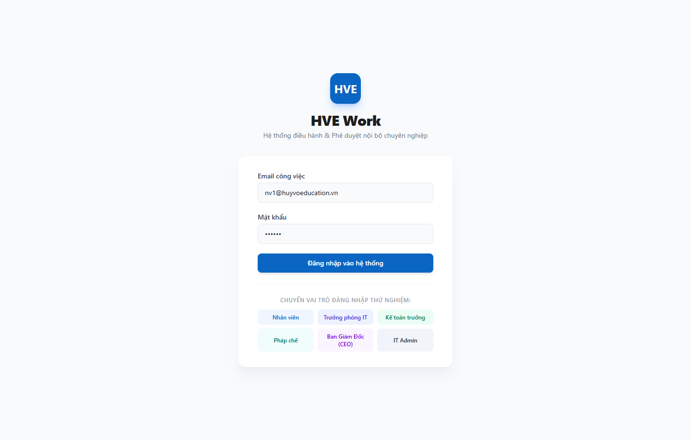
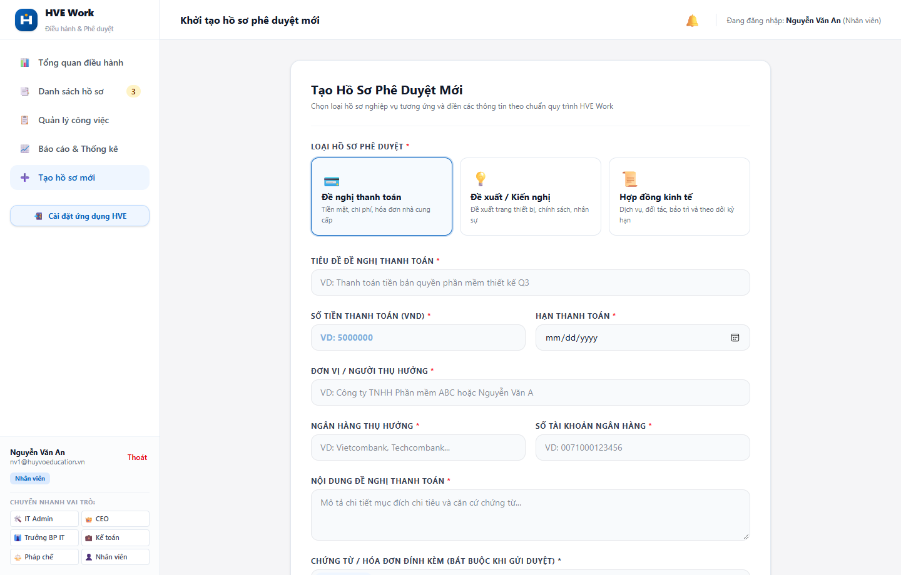
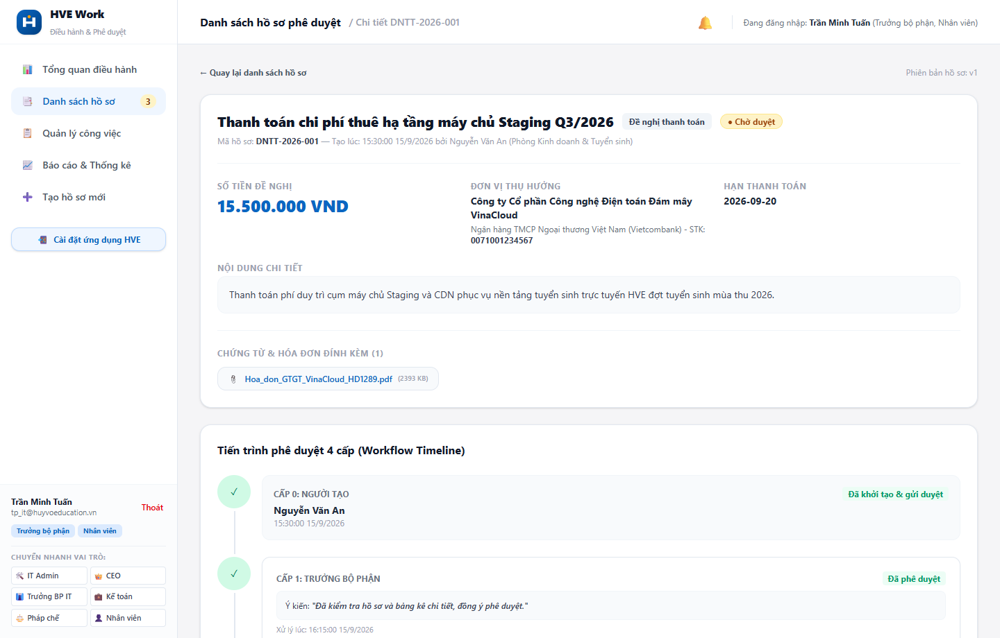
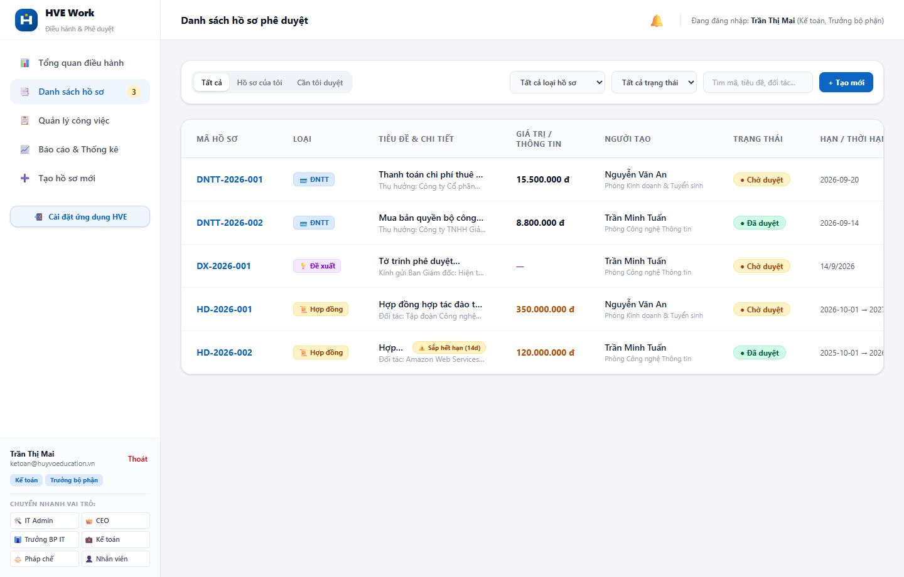
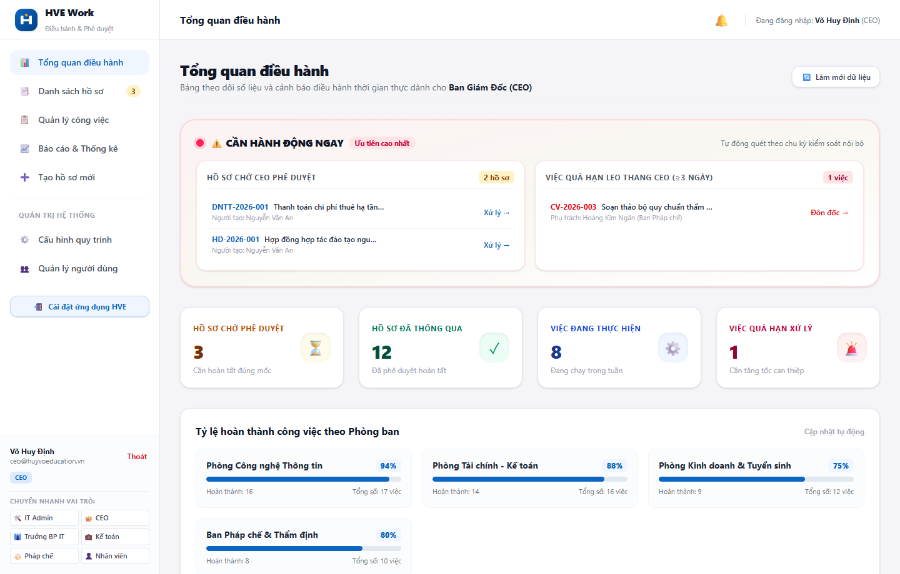
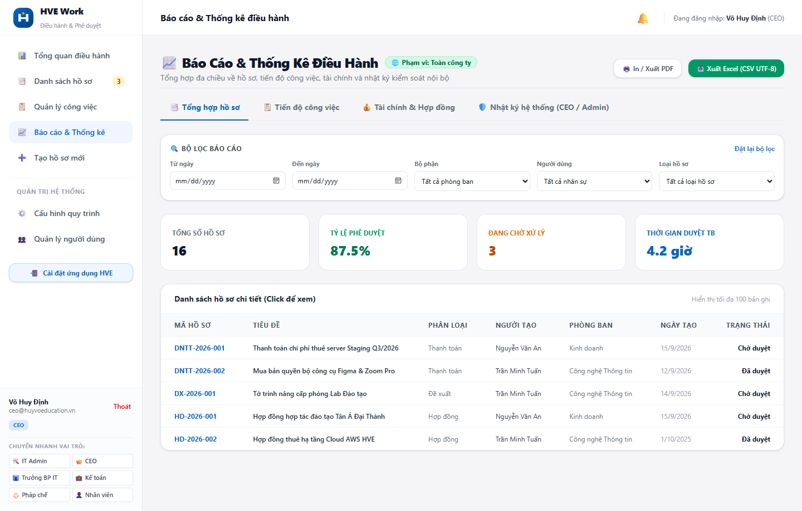
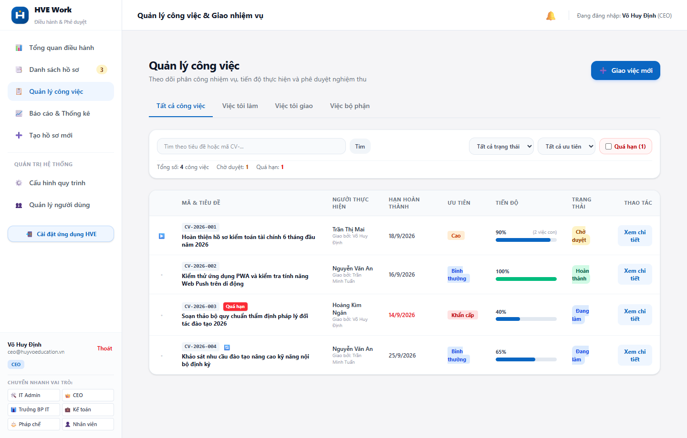
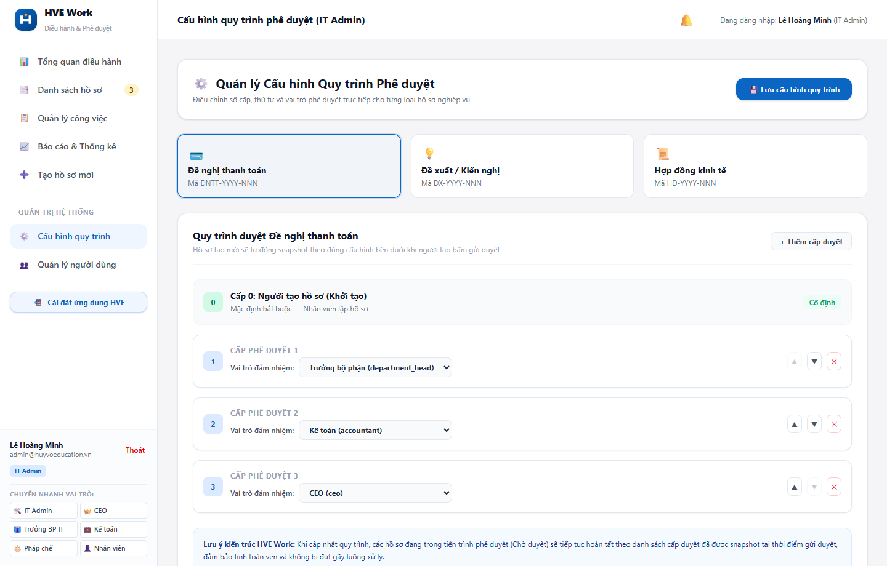
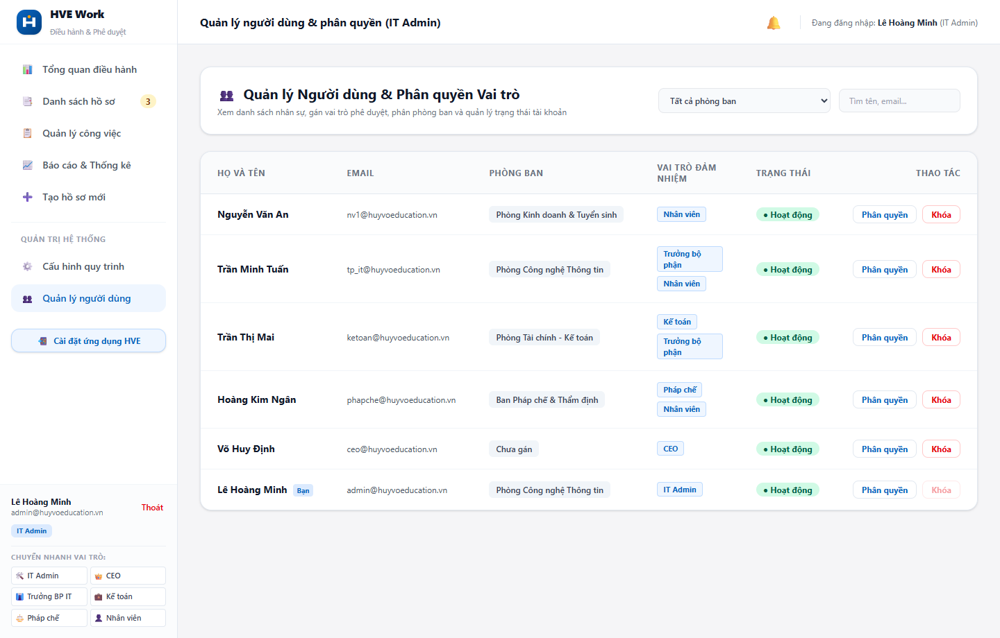

# SỔ TAY HƯỚNG DẪN SỬ DỤNG HỆ THỐNG HVE WORK
## NỀN TẢNG ĐIỀU HÀNH, PHÊ DUYỆT & QUẢN LÝ NHIỆM VỤ SỐ HÓA

  
   
  <strong>CÔNG TY CỔ PHẦN GIÁO DỤC HUY VÕ (HUY VÕ EDUCATION - HVE)</strong>
   
  <em>Hệ thống: HVE Work v1.0.0 — Bản Chuẩn Phát Hành Chính Thức 2026</em>
   
  <code>https://work.huyvoeducation.vn</code>

---

## 📞 KÊNH HỖ TRỢ KỸ THUẬT & CẤP QUYỀN NỘI BỘ

Trong quá trình vận hành hệ thống HVE Work, nếu gặp bất kỳ khó khăn nào về đăng nhập, tạo luồng duyệt hoặc cần phân quyền, cán bộ nhân viên liên hệ theo đầu mối:
- **Đơn vị hỗ trợ:** Phòng Công nghệ Thông tin - Huy Võ Education
- **Trưởng phòng IT:** **Anh Phạm Xuân Định** (Điện thoại / Zalo nội bộ: **0977.999.948**)
- **Quản trị hệ thống (IT Admin):** **Anh Lê Hoàng Ai** (Email: `admin@huyvoeducation.vn`)
- **Thời gian tiếp nhận:** **08:00 – 18:00 từ Thứ 2 đến Thứ 7 hàng tuần**

---

## 📌 MỤC LỤC TỔNG QUAN

1. [Chương 1: Tổng Quan Hệ Thống & Thao Tác Đăng Nhập](#chương-1-tổng-quan-hệ-thống--thao-tác-đăng-nhập)
2. [Chương 2: Cài Đặt Ứng Dụng Nhanh Lên Thiết Bị (PWA)](#chương-2-cài-đặt-ứng-dụng-nhanh-lên-thiết-bị-pwa)
3. [Chương 3: Hướng Dẫn Dành Cho Nhân Viên (Employee)](#chương-3-hướng-dẫn-dành-cho-nhân-viên-employee)
4. [Chương 4: Hướng Dẫn Dành Cho Trưởng Bộ Phận (Department Head)](#chương-4-hướng-dẫn-dành-cho-trưởng-bộ-phận-department-head)
5. [Chương 5: Hướng Dẫn Cho Bộ Phận Kế Toán & Pháp Chế (Accountant / Legal)](#chương-5-hướng-dẫn-cho-bộ-phận-kế-toán--pháp-chế-accountant--legal)
6. [Chương 6: Hướng Dẫn Dành Cho Ban Giám Đốc (CEO)](#chương-6-hướng-dẫn-dành-cho-ban-giám-đốc-ceo)
7. [Chương 7: Hướng Dẫn Quản Trị Hệ Thống Dành Cho IT Admin](#chương-7-hướng-dẫn-quản-trị-hệ-thống-dành-cho-it-admin)
8. [Chương 8: Ma Trận Phân Quyền & Quy Chuẩn Bảo Mật](#chương-8-ma-trận-phân-quyền--quy-chuẩn-bảo-mật)

---

## CHƯƠNG 1: TỔNG QUAN HỆ THỐNG & THAO TÁC ĐĂNG NHẬP

Hệ thống **HVE Work** là nền tảng quản trị và điều hành số hóa toàn diện của Huy Võ Education, tích hợp 3 phân hệ trụ cột:
- **Số hóa quy trình ký duyệt (Digital Approval Workflows):** Đề nghị thanh toán (ĐNTT), Đề xuất / Tờ trình nội bộ, Hợp đồng kinh tế và dịch vụ.
- **Điều hành & Quản lý nhiệm vụ (Task Management):** Phân rã công việc đa cấp, thiết lập tiến độ, lặp lại chu kỳ, chặn hoàn thành trái thẩm quyền và tự động cảnh báo trễ hạn.
- **Báo cáo điều hành & Kiểm soát nội bộ (Executive Analytics):** Thống kê thời gian thực, bảng kiểm soát chi phí, cảnh báo hợp đồng sắp hết hạn 30 ngày, xuất file Excel chuẩn tiếng Việt và nhật ký Audit Log.

### 1.1. Thao tác Đăng nhập hệ thống
1. Mở trình duyệt web (Google Chrome, Microsoft Edge, Safari) và truy cập địa chỉ: `https://work.huyvoeducation.vn`.
2. Nhập **Email công việc** được HVE cấp (ví dụ: `nv1@huyvoeducation.vn`, `tp_it@huyvoeducation.vn` hoặc `ceo@huyvoeducation.vn`).
3. Nhập **Mật khẩu cá nhân**.
4. Bấm nút **"Đăng nhập vào hệ thống"**.

*Hình 1.1: Giao diện Đăng nhập bảo mật đa người dùng của hệ thống HVE Work*

> [!NOTE]
> Sau khi nhận tài khoản và đăng nhập lần đầu thành công, nhân sự nên đổi mật khẩu ngay để đảm bảo tính riêng tư và an toàn thông tin của phòng ban.

---

## CHƯƠNG 2: CÀI ĐẶT ỨNG DỤNG NHANH LÊN THIẾT BỊ (PWA)

Hệ thống HVE Work hỗ trợ công nghệ **Progressive Web App (PWA)**, cho phép cài đặt trực tiếp lên màn hình chính (Home Screen) của điện thoại thông minh hoặc máy tính bảng/laptop mà không cần qua App Store hay Google Play.

### 2.1. Cài đặt trên điện thoại Android (Chrome / Edge)
1. Mở trình duyệt Chrome trên điện thoại và truy cập địa chỉ hệ thống.
2. Bấm vào nút **"📲 Cài đặt ứng dụng HVE"** ở chân thanh menu hoặc bảng thông báo phía dưới màn hình.
3. Chọn **"Cài đặt" (Install)** khi hộp thoại xác nhận hiện lên.
4. Biểu tượng ứng dụng HVE Work với logo chuẩn của Huy Võ Education sẽ xuất hiện ngay trên màn hình chính của điện thoại.

### 2.2. Cài đặt trên iPhone / iPad (iOS Safari)
1. Mở trình duyệt Safari trên iPhone và truy cập vào link hệ thống HVE Work.
2. Nhấn vào biểu tượng **Chia sẻ** *(hình vuông có mũi tên trỏ lên ⎋)* ở thanh Safari phía dưới.
3. Cuộn xuống và chọn mục **"Thêm vào MH chính" (Add to Home Screen)**.
4. Bấm **"Thêm" (Add)** ở góc trên bên phải màn hình.

---

## CHƯƠNG 3: HƯỚNG DẪN DÀNH CHO NHÂN VIÊN (EMPLOYEE)

Vai trò **Nhân viên** đảm nhiệm việc tạo lập các đề xuất chi tiêu, đề nghị thanh toán và cập nhật tiến độ công việc hàng ngày được phân công.

### 3.1. Khởi tạo Hồ sơ Phê duyệt mới
1. Nhấn vào mục **"➕ Tạo hồ sơ mới"** trên thanh Menu bên trái.
2. Lựa chọn một trong ba phân loại hồ sơ:
   - **Đề nghị thanh toán (ĐNTT):** Chi trả công tác phí, mua sắm văn phòng phẩm, thanh toán nhà cung cấp hạ tầng/dịch vụ.
   - **Đề xuất / Kiến nghị:** Tờ trình xin chủ trương, nâng cấp thiết bị, điều chỉnh chính sách nội bộ.
   - **Hợp đồng kinh tế:** Hợp đồng hợp tác đào tạo, cơ sở vật chất, chuyên gia giảng dạy.

*Hình 3.1: Giao diện Khởi tạo Đề nghị thanh toán (ĐNTT) với các trường dữ liệu kiểm soát*

#### Các trường thông tin bắt buộc khi tạo ĐNTT:
- **Tiêu đề đề nghị:** Mô tả ngắn gọn, rõ ràng mục đích thanh toán (Ví dụ: *Thanh toán chi phí thuê hạ tầng máy chủ Staging Q3/2026*).
- **Số tiền thanh toán (VND):** Nhập đúng số tiền thực tế theo hóa đơn chứng từ.
- **Hạn thanh toán:** Chọn ngày cần hoàn tất chi trả.
- **Đơn vị / Người thụ hưởng:** Tên pháp nhân công ty hoặc cá nhân thụ hưởng.
- **Ngân hàng & Số tài khoản:** Điền chính xác số tài khoản và ngân hàng thụ hưởng.
- **Nội dung chi tiết:** Thuyết minh lý do chi, căn cứ hợp đồng hoặc biên bản nghiệm thu.
- **Tệp chứng từ đính kèm (Bắt buộc khi gửi duyệt):** Tải lên bản scan hóa đơn VAT, phiếu thu, báo giá hoặc hợp đồng (định dạng PDF, PNG, JPG). Hệ thống **chặn gửi duyệt** nếu hồ sơ thanh toán chưa có chứng từ hợp lệ.

3. Nhấn **"Lưu bản nháp"** nếu muốn tiếp tục chỉnh sửa sau, hoặc nhấn **"Gửi duyệt ngay"** để chuyển hồ sơ lên cấp Trưởng bộ phận.

---

### 3.2. Theo dõi Luồng duyệt & Xử lý khi Hồ sơ bị Trả lại
Sau khi gửi duyệt, nhân viên mở mục **"Danh sách hồ sơ"** ➔ chọn tab **"Hồ sơ của tôi"** và bấm vào từng mã hồ sơ để xem chi tiết tiến trình phê duyệt (Workflow Timeline).

*Hình 3.2: Chi tiết hồ sơ và Dòng thời gian phê duyệt đa cấp (Workflow Timeline)*

- **Trường hợp hồ sơ bị "Trả lại":**
  1. Mở chi tiết hồ sơ, đọc kỹ **Ý kiến phản hồi** của Trưởng phòng hoặc Kế toán ghi rõ lý do.
  2. Nhấn nút **"Chỉnh sửa hồ sơ"**.
  3. Bổ sung hóa đơn, sửa số tiền hoặc thông tin thụ hưởng theo yêu cầu.
  4. Nhấn **"Gửi duyệt lại"** để hồ sơ tiếp tục chu trình phê duyệt.
- **Trường hợp hồ sơ đã "Được duyệt hoàn tất" nhưng cần sửa đổi:**
  - Nhấn nút **"Tạo phiên bản sửa đổi"** để tự động sinh mã `-v2`. Bản gốc vẫn được lưu vết độc lập phục vụ kiểm toán tài chính.

---

### 3.3. Quản lý Tiến độ Công việc Cá nhân
1. Nhấn vào mục **"📋 Quản lý công việc"** ➔ chọn tab **"Việc tôi làm"**.
2. **Khi bắt đầu làm:** Chuyển trạng thái từ *Chưa làm* ➔ *Đang làm*.
3. **Cập nhật tiến độ:** Kéo thanh trượt **Tiến độ (%)** từ 0% đến 100% tương ứng với khối lượng công việc đã triển khai.
4. **Báo cáo hoàn thành:** Khi đạt 100%, nhấn nút **"Báo cáo hoàn thành (Chờ duyệt)"** và nhập ghi chú kết quả công việc bàn giao.

> [!IMPORTANT]
> **Nguyên tắc kỷ luật công việc:** Người thực hiện **không có quyền tự đóng việc sang "Hoàn thành"**. Việc hoàn thành chỉ được xác nhận chính thức khi Người giao việc (Trưởng phòng hoặc CEO) kiểm tra kết quả và bấm **"Xác nhận hoàn thành"**.

---

## CHƯƠNG 4: HƯỚNG DẪN DÀNH CHO TRƯỞNG BỘ PHẬN (DEPARTMENT HEAD)

Trưởng bộ phận đóng vai trò chốt chặn quan trọng chịu trách nhiệm về tính xác thực của đề xuất, ngân sách phòng ban và điều phối công việc của nhân sự trực thuộc.

### 4.1. Phê duyệt Hồ sơ Phòng ban
1. Vào mục **"Danh sách hồ sơ"** ➔ bấm tab **"Cần tôi duyệt"** hoặc xem tại khối **"CẦN HÀNH ĐỘNG NGAY"** trên màn hình Tổng quan.

*Hình 4.1: Danh sách hồ sơ phòng ban chờ Trưởng bộ phận thẩm định và xử lý*

2. Bấm vào mã hồ sơ để xem chi tiết và lựa chọn 1 trong 3 hành động:
   - **"Phê duyệt" (Approve):** Đồng ý nội dung, chuyển tiếp lên Kế toán hoặc CEO.
   - **"Trả lại" (Return):** Yêu cầu nhân viên bổ sung giấy tờ hoặc sửa lại thông tin (*Bắt buộc nhập lý do*).
   - **"Từ chối" (Reject):** Bác bỏ hoàn toàn hồ sơ nếu không phù hợp định hướng/ngân sách (*Bắt buộc nhập lý do*).

---

### 4.2. Giao việc & Điều hành Công việc Phòng ban
1. Vào mục **"📋 Quản lý công việc"** ➔ Nhấn nút **"➕ Giao việc mới"**.
2. Nhập các thông tin bắt buộc:
   - **Tiêu đề công việc:** Nêu rõ mục tiêu công việc.
   - **Người thực hiện:** Chọn nhân sự thuộc phòng ban quản lý.
   - **Mức ưu tiên:** Thấp / Bình thường / Cao / Khẩn cấp.
   - **Hạn hoàn thành (Deadline):** Chọn ngày giờ hoàn thành.
3. Thiết lập tính năng nâng cao:
   - **Thêm việc con (Subtasks):** Chia nhỏ công việc lớn thành các đầu việc con để các nhân sự cùng phối hợp. *(Lưu ý: Công việc có việc con sẽ tự động tính tiến độ theo trung bình các việc con, khóa kéo tay).*
   - **Lặp lại định kỳ (Recurrence):** Cấu hình tự động sinh công việc mới theo chu kỳ: *Hàng ngày, Hàng tuần, Hàng tháng*.
4. **Nghiệm thu công việc:** Xem tab **"Việc tôi giao"** ➔ Chọn công việc có trạng thái **"Chờ duyệt"** ➔ Kiểm tra kết quả nhân viên báo cáo và nhấn **"Xác nhận hoàn thành"**.

---

## CHƯƠNG 5: HƯỚNG DẪN CHO BỘ PHẬN KẾ TOÁN & PHÁP CHẾ (ACCOUNTANT / LEGAL)

### 5.1. Kế toán (`accountant`) — Kiểm soát Chi phí & Thanh toán
- **Thẩm định Đề nghị thanh toán (Cấp 2):**
  - Đối chiếu số tiền đề nghị với hóa đơn VAT hợp pháp, hợp lệ đính kèm trong hồ sơ.
  - Rà soát tính chính xác của Số tài khoản, Ngân hàng thụ hưởng để tránh chi nhầm.
  - Phê duyệt để hồ sơ được chuyển tiếp lên Ban Giám Đốc (CEO) phê duyệt chi tiền.
- **Giám sát Quỹ & Hạn mục Hợp đồng:**
  - Vào mục **📈 Báo cáo & Thống kê** ➔ Chọn tab **"💰 Tài chính & Hợp đồng"**.
  - Xem tổng giải ngân thực tế trong kỳ và danh sách hợp đồng sắp đến kỳ thanh toán hoặc sắp hết hạn.

*Hình 5.1: Màn hình kiểm soát, đối chiếu chứng từ và quản lý hợp đồng kinh tế của Kế toán*

---

### 5.2. Pháp chế (`legal`) — Thẩm định Rủi ro Hợp đồng Kinh tế
- **Thẩm định Hợp đồng (Cấp 2 của luồng Hợp đồng):**
  - Rà soát các điều khoản trách nhiệm, điều kiện nghiệm thu, điều khoản thanh toán, bảo mật và cơ chế giải quyết tranh chấp.
  - Ghi nhận ý kiến tư vấn pháp lý trực tiếp vào ô phản hồi của cấp duyệt.
  - Duyệt thông qua để hồ sơ chuyển tiếp sang Kế toán rà soát tài chính trước khi trình CEO ký duyệt.
- **Cảnh báo Hạn hợp đồng 30 ngày:**
  - Hệ thống tự động gắn nhãn cảnh báo màu cam **"⚠️ Sắp hết hạn (<= 30 ngày)"** đối với các hợp đồng đối tác. Pháp chế chủ động thông báo bộ phận phụ trách để tiến hành ký phụ lục gia hạn hoặc lập biên bản thanh lý hợp đồng.

---

## CHƯƠNG 6: HƯỚNG DẪN DÀNH CHO BAN GIÁM ĐỐC (CEO)

Ban Giám Đốc sử dụng HVE Work để nắm bắt toàn cảnh vận hành của công ty theo thời gian thực và phê duyệt các quyết định trọng yếu.

### 6.1. Trung tâm Điều hành Thời gian thực (Executive Dashboard)
Màn hình Tổng quan cung cấp bức tranh toàn diện về vận hành doanh nghiệp:

*Hình 6.1: Dashboard điều hành thời gian thực dành cho Ban Giám Đốc (CEO)*

- **Khối "CẦN HÀNH ĐỘNG NGAY" (Báo động đỏ):**
  - **Hồ sơ chờ CEO phê duyệt:** Toàn bộ ĐNTT giá trị lớn, tờ trình kế hoạch hoặc hợp đồng đã qua các phòng ban thẩm định.
  - **Việc quá hạn leo thang CEO (≥ 3 ngày):** Tự động phát hiện và hiển thị các công việc trọng yếu bị trễ hạn từ 3 ngày trở lên mà cấp phòng chưa giải quyết dứt điểm.
- **Thước đo Hiệu suất (KPI Cards):** Số lượng hồ sơ chờ duyệt, hồ sơ đã thông qua, việc đang chạy và việc trễ hạn.
- **Biểu đồ Tỷ lệ hoàn thành công việc theo Phòng ban:** Giám sát năng suất của từng bộ phận (Công nghệ thông tin, Kế toán, Kinh doanh & Tuyển sinh, Pháp chế...).

---

### 6.2. Trung tâm Báo cáo, Thống kê & Phân tích Đa chiều
Vào mục **"📈 Báo cáo & Thống kê"**:

*Hình 6.2: Trung tâm Báo cáo & Thống kê điều hành đa chiều với chức năng xuất dữ liệu tức thì*

- **Bộ lọc đa chiều 5 tiêu chí:** Lọc linh hoạt theo *Từ ngày - Đến ngày*, *Phòng ban*, *Nhân sự cụ thể* và *Loại hồ sơ*.
- **Xuất Excel nhanh (CSV UTF-8):** Bấm nút **"📥 Xuất Excel (CSV UTF-8)"** để tải về báo cáo định dạng chuẩn tiếng Việt không bị lỗi font trên Microsoft Excel Windows.
- **Nhật ký hệ thống (Audit Log):** Cho phép Ban Giám Đốc và IT Admin truy vết chi tiết: Ai đã tạo, sửa đổi, phê duyệt, từ chối hoặc xuất dữ liệu vào thời gian nào.

---

### 6.3. Bảng Điều hành & Kiểm Soát Công Việc Toàn Công Ty

*Hình 6.3: Giao diện Quản lý công việc đa cấp, theo dõi tiến độ và kiểm soát việc quá hạn*

---

## CHƯƠNG 7: HƯỚNG DẪN QUẢN TRỊ HỆ THỐNG DÀNH CHO IT ADMIN

Dành riêng cho Quản trị viên hệ thống để duy trì cấu hình nghiệp vụ và quản trị nhân sự.

### 7.1. Cấu hình Quy trình Phê duyệt Động (Approval Matrix)
Vào mục **"⚙️ Cấu hình quy trình"**:
- Tùy biến số cấp duyệt và phân vai trò duyệt độc lập cho từng loại hồ sơ:
  - *Đề nghị thanh toán:* Người tạo (0) ➔ Trưởng phòng (1) ➔ Kế toán (2) ➔ CEO (3).
  - *Đề xuất / Kiến nghị:* Người tạo (0) ➔ Trưởng phòng (1) ➔ CEO (2).
  - *Hợp đồng kinh tế:* Người tạo (0) ➔ Trưởng phòng (1) ➔ Pháp chế (2) ➔ Kế toán (3) ➔ CEO (4).
- Có thể thêm cấp, xóa cấp hoặc di chuyển thứ tự ưu tiên các bước bằng nút mũi tên lên/xuống.
- Bấm **"💾 Lưu cấu hình quy trình"** để kích hoạt ma trận phê duyệt mới cho các hồ sơ tạo sau thời điểm lưu.

*Hình 7.1: Giao diện Cấu hình ma trận quy trình phê duyệt động (Approval Matrix)*

---

### 7.2. Quản lý Người dùng & Phân quyền Vai trò
Vào mục **"👥 Quản lý người dùng"**:
- Danh sách toàn bộ nhân sự công ty với đầy đủ thông tin: Họ tên, Email, Phòng ban công tác, Các vai trò kiêm nhiệm và Trạng thái tài khoản (*Hoạt động / Khóa*).
- **Phân quyền vai trò:** Cấp quyền linh hoạt cho một nhân sự đảm nhiệm nhiều vai trò (ví dụ: vừa là *Nhân viên*, vừa là *Trưởng bộ phận* hoặc *Kế toán*).
- **Khóa tài khoản:** Tạm ngừng quyền truy cập tức thì khi nhân sự nghỉ việc hoặc chuyển công tác, bảo vệ tuyệt đối dữ liệu nội bộ.

*Hình 7.2: Bảng quản lý người dùng và phân quyền vai trò chi tiết*

---

## CHƯƠNG 8: MA TRẬN PHÂN QUYỀN & QUY CHUẨN BẢO MẬT

### 8.1. Bảng Ma Trận Phân Quyền Chi Tiết Theo Vai Trò

| Nghiệp vụ / Thao tác | Nhân viên | Trưởng phòng | Kế toán / Pháp chế | Ban Giám Đốc (CEO) | Quản trị IT Admin |
| :--- | :---: | :---: | :---: | :---: | :---: |
| **Khởi tạo ĐNTT / Đề xuất / Hợp đồng** | Cho phép | Cho phép | Cho phép | Toàn quyền | Hạn chế |
| **Phê duyệt Cấp 1 (Trưởng phòng)** | Không | Phòng mình | Không | Toàn quyền | Không |
| **Thẩm định Kế toán & Pháp chế** | Không | Không | Theo chuyên môn | Toàn quyền | Không |
| **Phê duyệt Tối cao (CEO)** | Không | Không | Không | Chính thức | Không |
| **Giao việc & Nghiệm thu việc** | Việc của mình | Trong phòng | Trong phòng | Toàn công ty | Kỹ thuật |
| **Xem Báo cáo & Xuất Excel** | Cá nhân | Phòng ban | Tài chính/Hợp đồng | Toàn công ty | Toàn công ty |
| **Cấu hình Quy trình & User** | Không | Không | Không | Xem/Chỉ đạo | Toàn quyền |

### 8.2. Quy Tắc Bảo Mật Dành Cho Cán Bộ Nhân Viên
1. **Tuyệt đối không chia sẻ mật khẩu:** Mỗi tài khoản gắn liền với chữ ký số nội bộ và lịch sử Audit Log pháp lý.
2. **Đăng xuất khi rời vị trí làm việc:** Luôn nhấn nút **"Thoát"** khi không sử dụng máy tính.
3. **Kiểm tra kỹ hóa đơn chứng từ trước khi phê duyệt:** Cấp duyệt chịu trách nhiệm về tính hợp pháp của các khoản chi đã duyệt.

---

### 📞 KÊNH TIẾP NHẬN HỖ TRỢ KỸ THUẬT NỘI BỘ HVE:
- **Đơn vị phụ trách:** Phòng Công nghệ Thông tin - Huy Võ Education
- **Trưởng phòng IT:** **Anh Phạm Xuân Định** (Điện thoại / Zalo nội bộ: **0977.999.948**)
- **Quản trị hệ thống (IT Admin):** **Anh Lê Hoàng Ai** (Email: `admin@huyvoeducation.vn`)
- **Thời gian tiếp nhận:** **08:00 – 18:00 từ Thứ 2 đến Thứ 7 hàng tuần**

---
*© 2026 HUY VO EDUCATION (HVE) — TÀI LIỆU BẢN QUYỀN LƯU HÀNH NỘI BỘ.*
